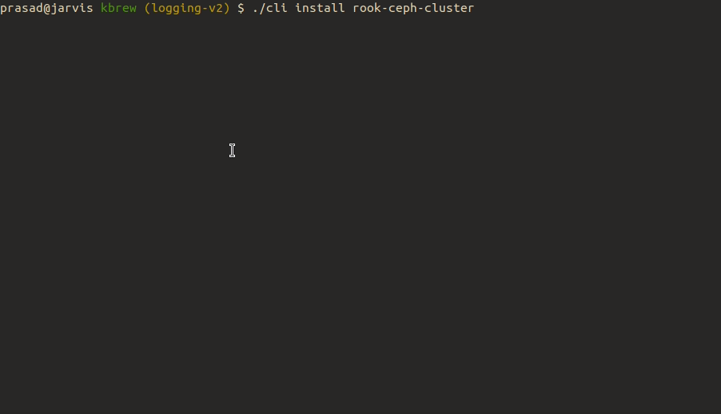

# kbrew

[](https://github.com/kbrew-dev/kbrew/actions/workflows/go.yml) [](https://goreportcard.com/report/github.com/kbrew-dev/kbrew)
[](https://github.com/kbrew-dev/kbrew/releases/latest)
[](https://github.com/kbrew-dev/kbrew/blob/main/LICENSE)


kbrew is a CLI tool for Kubernetes which makes installing any complex stack easy in `one step` (And yes we are definitely inspired by Homebrew from MacOS)

Let's take the example of installing Kafka on a Kubernetes cluster. If you are a developer trying this on a non-prod environment, you want a quick and simple way to set it up. But a typical process looks like this:

 - You need a cert-manager, Zookeeper & kube-prometheus-stack for monitoring installed.
 - Zookeeper is an operator so you need to create a CR of the Zookeeper cluster after installation of the operator is done.
 - Then you have to install Kafka operator.
 - Finally, you have to create a CR of Kafka and wait for everything to stabilize.
 - And lastly, create a ServiceMonitor resource to enable Prometheus scraping.

With kbrew, all of this happens with a "one step":

```
kbrew install kafka-operator
```

Similarly when you install a Rook Ceph cluster - it makes it a `one step easy`:



> Any engineering is not without tradeoffs and we are not claiming that this is a silver bullet. Please refer to the Goals and FAQ sections for details.

Table of Contents
=================

* [Goals](#goals)
   * [One step Easy for users](#one-step-easy-for-users)
   * [Fully Configured &amp; functional](#fully-configured--functional)
   * [Recipe - abstracts complexity!](#recipe---abstracts-complexity)
* [Installation](#installation)
   * [Install the pre-compiled binary](#install-the-pre-compiled-binary)
   * [Compiling from source](#compiling-from-source)
      * [Step 1: Clone the repo](#step-1-clone-the-repo)
      * [Step 2: Build binary using make](#step-2-build-binary-using-make)
* [CLI Usage](#cli-usage)
   * [Commonly used commands](#commonly-used-commands)
      * [kbrew search](#kbrew-search)
      * [kbrew info](#kbrew-info)
      * [kbrew install](#kbrew-install)
      * [kbrew update](#kbrew-update)
      * [kbrew remove](#kbrew-remove)
* [Recipes](#recipes)
   * [Recipe structure](#recipe-structure)
      * [Application](#application)
         * [Arguments](#arguments)
      * [Pre &amp; Post Install](#pre--post-install)
      * [Pre and Post Cleanup](#pre-and-post-cleanup)
* [FAQ](#faq)
   * [How is kbrew different than Helm or Kubernetes Operator?](https://github.com/kbrew-dev/kbrew#how-is-kbrew-different-than-helm-or-kubernetes-operator)
   * [Should I use kbrew for installing applications in a production environment?](#should-i-use-kbrew-for-installing-applications-in-a-production-environment)
   * [How can I contribute recipes for a project/tool?](#how-can-i-contribute-recipes-for-a-projecttool)
   * [How is analytics used?](#how-is-analytics-used)
   * [What data is collected for analytics?](#what-data-is-collected-for-analytics)
   * [Who is developing kbrew?](#who-is-developing-kbrew)

Created by [gh-md-toc](https://github.com/ekalinin/github-markdown-toc)

## Goals

### `One step` Easy for users

We are basically optimizing for `one step` install easy for developers. You end up installing applications in dev/tinkering environments multiple times and it should not be this hard. Also, you should not have to write `glue code` or shell scripts to make it work!

### Fully Configured & functional

`One step` would not be true to its promise if you had to `configure` things such as StorageClass or verify the version of Kubernetes etc. It should work and be fully functional to use right after installation.

### Recipe - abstracts complexity!

While we are making it easy for users to install any application in one step, we are pushing the complexity to the recipe. This means the recipe authors have to understand and write recipes that just work!

## Installation

<details>
   <summary>(Click to expand)</summary> 
 
### Install the pre-compiled binary

```bash
export BINDIR=/usr/local/bin
curl -sfL https://raw.githubusercontent.com/kbrew-dev/kbrew/main/install.sh | sh
```

### Compiling from source

#### Step 1: Clone the repo

```bash
git clone https://github.com/kbrew-dev/kbrew.git
```

#### Step 2: Build binary using make

```bash
make
```
</details>
 
## CLI Usage

<details>
   <summary>(Click to expand)</summary> 

```
$ kbrew --help
A CLI tool for Kubernetes which makes installing any complex stack easy in one step.

Usage:
  kbrew [command]

Available Commands:
  analytics   Manage analytics setting
  completion  Output shell completion code for the specified shell
  help        Help about any command
  info        Describe application
  install     Install application
  remove      Remove application
  search      Search application
  update      Update kbrew and recipe registries
  version     Print version information

Flags:
  -c, --config string       config file (default is $HOME/.kbrew.yaml)
      --config-dir string   config dir (default is $HOME/.kbrew)
      --debug               enable debug logs
  -h, --help                help for kbrew
  -n, --namespace string    namespace

Use "kbrew [command] --help" for more information about a command.
```

### Commonly used commands

#### kbrew search

Searches for a recipe for the given application. Lists all the available recipes if no application name is passed.

#### kbrew info

Prints applications details including registry and dependency information. 

#### kbrew install

Installs a recipe in your cluster with all pre & posts steps and applications.

#### kbrew update

Checks for kbrew updates and upgrades automatically if a newer version is available. Fetches updates for all the kbrew recipe registries

#### kbrew remove 

Uninstalls the application and its dependencies.

</details>
 
## Recipes

A kbrew recipe is a YAML file that declares the installation process of a Kubernetes app. It allows to *brew* Helm charts or vanilla Kubernetes manifests with scripts, also managing dependencies with other recipes.

Recipes can be grouped in a structured directory called `Registry`. kbrew uses the [kbrew-registry](https://github.com/kbrew-dev/kbrew-registry/) by default.

### Recipe structure

The process of how kbrew manages the installation of an app according to the recipe specification is depicted below. As can be seen, kbrew takes care of the order of pre/post actions.


Similarly, while removing an app, kbrew takes care of the order of removal of the dependent apps and the cleanup steps specified via `pre/post_cleanup` in the recipe.


A bare-bones structure of a recipe is a composition of pre-install steps, install and post-install steps. Each step could have another application being installed or a further set of steps.

```
apiVersion: v1
kind: kbrew
app:
  repository:
    url: https://raw.githubusercontent.com/repo/manifest.yaml
    type: raw
  args:
    Deployment.nginx.spec.replicas: 4
  namespace: default
  version: v0.17.0
  pre_install:
  - apps:
      - OtherApp
  - steps:
      - echo "installing app"
  post_install:
  - steps:
      - echo "done installing"
  pre_cleanup:
  - steps
      - echo "deleting prerequisite"
  post_cleanup:
  - steps:
      - echo "app deleted"
```

#### Application

- `app` is the declaration of how a Kubernetes application - a Helm chart or a YAML manifest - will get installed.
  * `repository`: defines the source of the app
    - `url`: location of a Helm chart or a Kubernetes YAML manifest
    - `type`: can be `helm` or `raw`

For example for the Kafka recipe, we will use the Helm chart from Banzaicloud and point to the Helm repo where the chart is available.

```
app:
  repository:
    name: banzaicloud-stable
    url: https://kubernetes-charts.banzaicloud.com
    type: helm
```

##### Arguments

kbrew allows you to modify the app via arguments that can modify the Helm chart values or manifest field values.  kbrew supports passing arguments to recipes as [Go templates](https://pkg.go.dev/text/template).

All the functions from the [Sprig library](http://masterminds.github.io/sprig/) and the [lookup](https://helm.sh/docs/chart_template_guide/functions_and_pipelines/#using-the-lookup-function) & [include](https://helm.sh/docs/howto/charts_tips_and_tricks/#using-the-include-function) functions from Helm are supported.

**Helm app**: Arguments to a helm app can be the key-value pairs offered by the chart in its values.yaml file.

**Raw app**: These arguments patch the manifest of a raw app and can be specified in the format: `<Kind>.<Name>.<FieldPath>: <value>`. For example, to change `spec.replicas` of a `Deployment` named `nginx`, specify `Deployment.nginx.spec.replicas`

For example for [Nginx Ingress recipe](https://github.com/kbrew-dev/kbrew-registry/blob/19d9cd3ae269265c1e3147918a3a2287fc006bda/recipes/ingress-nginx.yaml) we configure an annotation if the application is being installed in AWS EKS or Digital Ocean.

```
app:
  args:
    # annotation for EKS
    controller.service.annotations."service\.beta\.kubernetes\.io/aws-load-balancer-type": '{{ $providerID := (index (lookup "v1" "Node" "" "").items 0).spec.providerID }}{{ if hasPrefix "aws" $providerID }}nlb{{end}}'
    # annotations for Digital Ocean
    controller.service.annotations."service\.beta\.kubernetes\.io/do-loadbalancer-enable-proxy-protocol": '{{ $providerID := (index (lookup "v1" "Node" "" "").items 0).spec.providerID }}{{ if hasPrefix "digitalocean" $providerID }}true{{end}}'
```

* `namespace`: Kubernetes namespace where the app should be installed. If not specified, `default` is used for installation.

#### Pre & Post Install

Pre and post-install sections allow the recipe author to do steps needed before or after the installation of the core application.  This could be for example:

- Checking for compatibility of cluster or the environment-specific things such as `StorageClass`.
- Install another dependency application by using the recipe of that application.
- After installation wait for setup to be ready and fully functional.
- Create CRs of a specific application so that it is fully functional and ready to use.

Let's look at some examples. In the RookCeph recipe, we install the operator as a dependency application:

```
pre_install:
  - apps:
    - rook-ceph-operator
```    

In the Minio recipe, we check the version of Kubernetes so that only compatible versions of Kubernetes are used for rest of the install

```
pre_install:
  - steps:
    - |
      # Prerequisites
      # https://github.com/minio/operator#prerequisites
      minK8sVersion="v1.19.0"
      expected=$(echo $minK8sVersion |  sed 's/v//g' | sed 's/\.//g')
      k8sVersion=$(kubectl version --short=true --output json | jq -r ".serverVersion.gitVersion" | sed 's/-.*//g' | sed 's/v//g' | sed 's/\.//g')
      if [ $expected -gt $k8sVersion ]
      then
        echo "The cluster does not meet requirements."
        echo "Kubernetes version v1.19.0 or later required."
        exit 1
      fi
```

Or for example, in case of Minio, the `StorageClass` should have the value of `volumeBindingMode` as `WaitForFirstConsumer` - and is one of the prerequisites for the installation:

```
pre_install:
  - steps:
    - |
      # Prerequisites - The StorageClass must have volumeBindingMode: WaitForFirstConsumer
      # https://github.com/minio/operator#prerequisites
      scList=$(kubectl get storageclass -o jsonpath='{.items[?(@.volumeBindingMode=="WaitForFirstConsumer")].metadata.name}')
      if [ -z "$scList" ]
      then
        echo "The cluster does not meet requirements."
        echo "Atleast 1 StorageClass should have WaitForFirstConsumer volumeBindingMode."
        exit 1
      fi
```      

#### Pre and Post Cleanup

The `pre_cleanup` and `post_cleanup` are very similar to the `pre_install` and `post_install` steps but are used in the uninstall lifecycle.

## FAQ

##### How is kbrew different than Helm or Kubernetes Operator?

Kbrew uses Helm charts and operators both under the hood. Kbrew acts as a `glue code` that makes combination of installing a Helm chart, creating a manifest CR etc. into a single command that also tries to make some decisions such as StorageClass configuration etc. It is great for developers who wants to just get something running fast and fully working!

##### Should I use kbrew for installing applications in a production environment?

At this point, kbrew is not meant to install applications in production. It makes installing applications easy for developers and anyone tinkering and installing frequently

##### How can I contribute recipes for a project/tool?

The recipes are maintained in [Kbrew registry](https://github.com/kbrew-dev/kbrew-registry), and if a recipe does not exist then please raise an issue and you can contribute to the registry.

##### How is analytics used?

The analytics is anonymized and used in aggregate to determine the failure/success rate of recipes and to improve user experience.

##### What data is collected for analytics?

Please check [analytics](docs/analytics.md) for details.

##### Who is developing kbrew?

The team at [InfraCloud](https://www.infracloud.io/) is supporting Kbrew's development with love! But we love contributions from the community.
